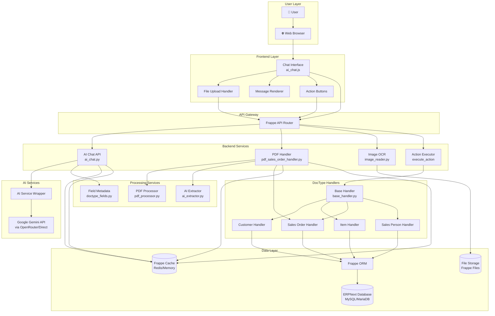
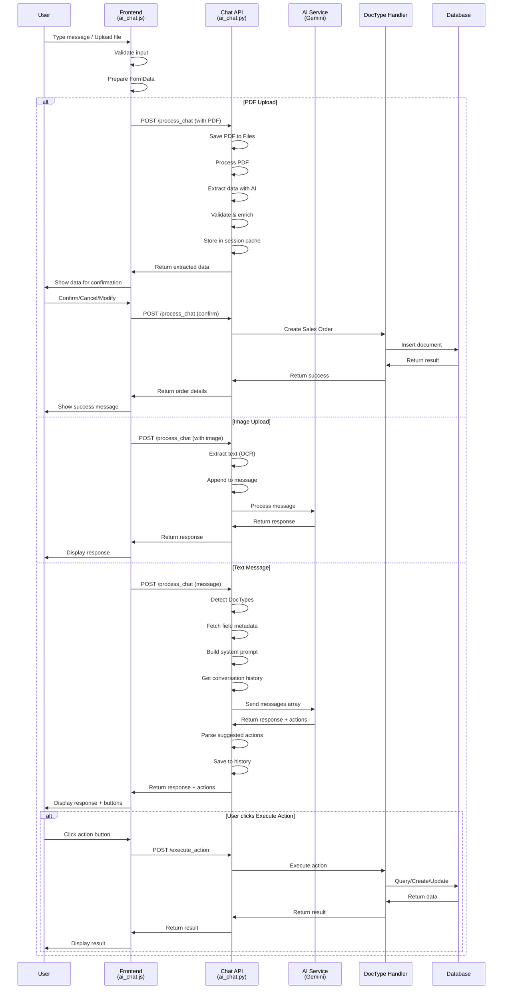
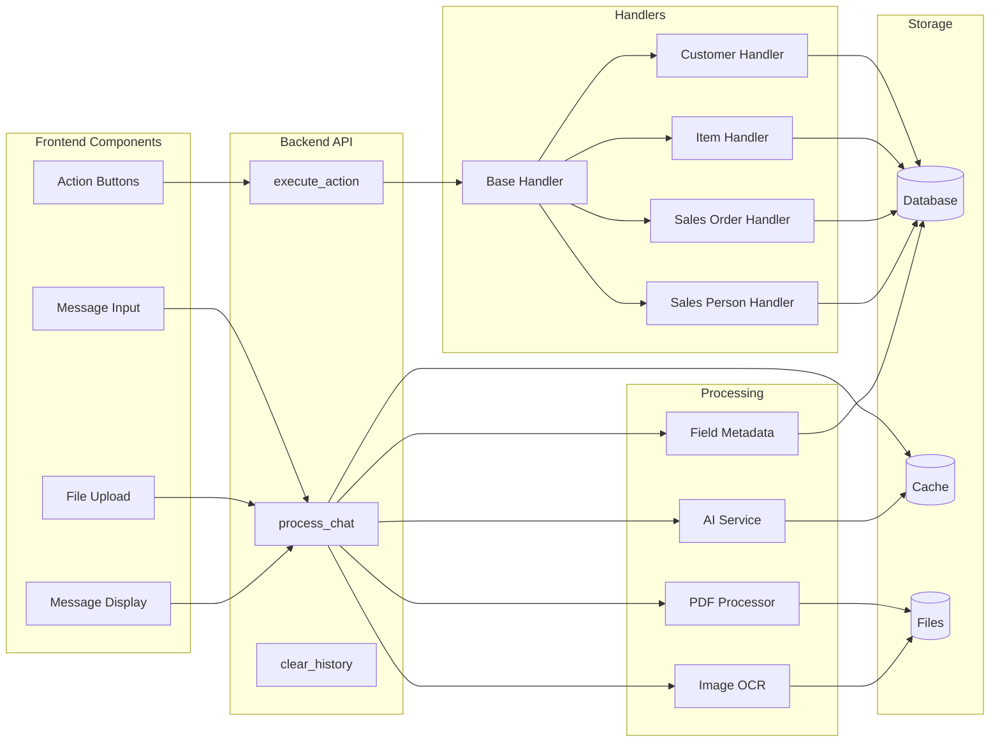
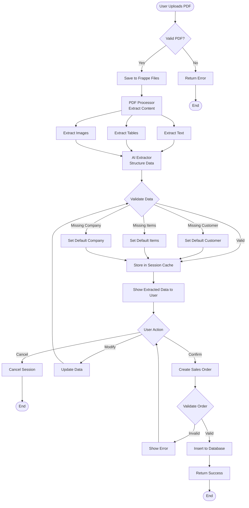
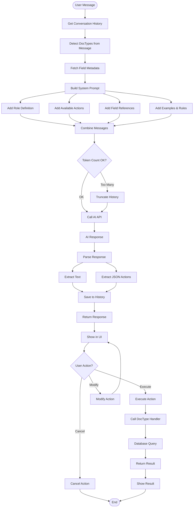
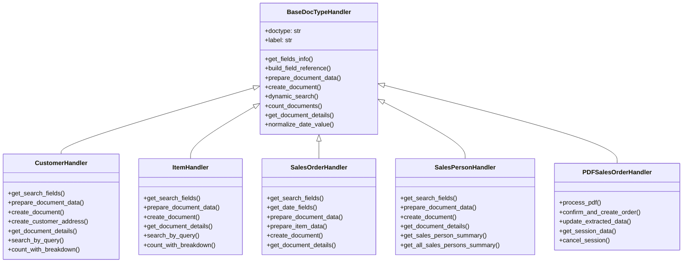
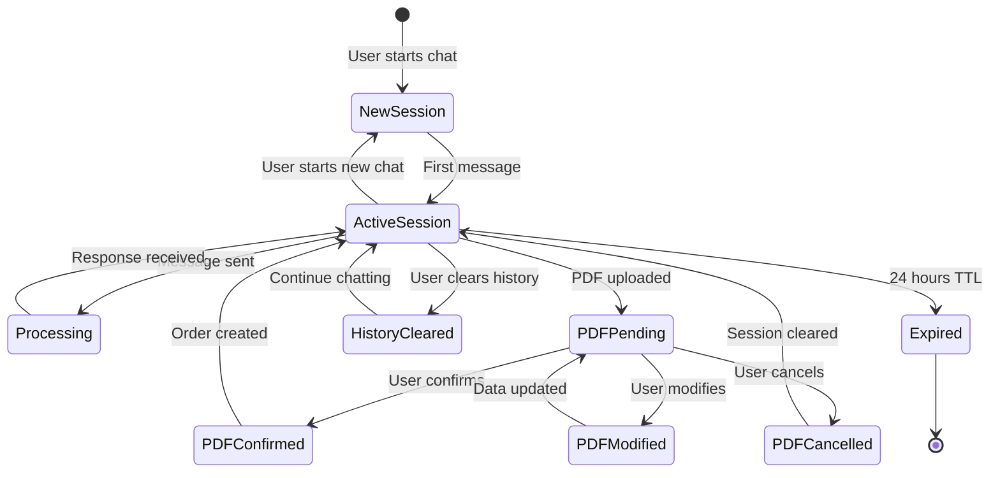
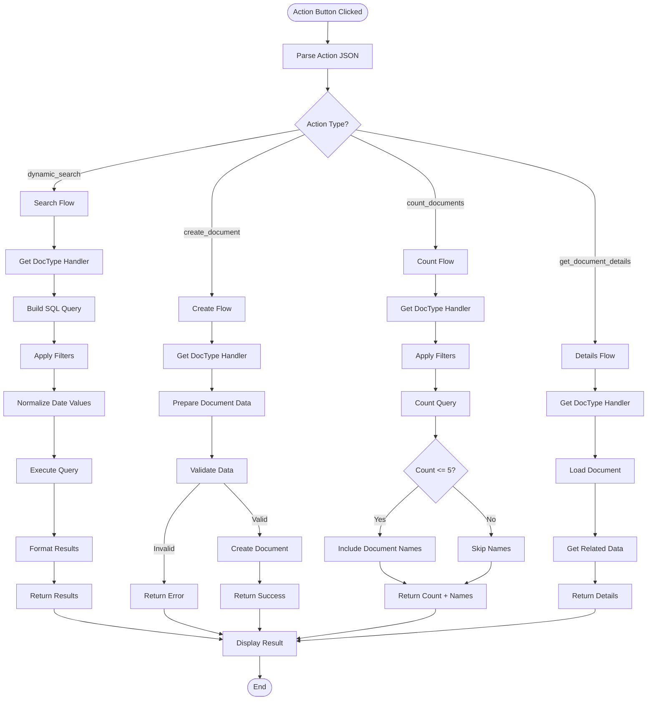
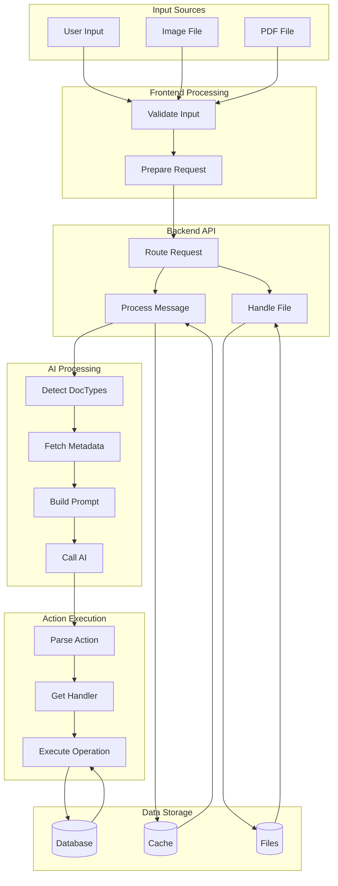
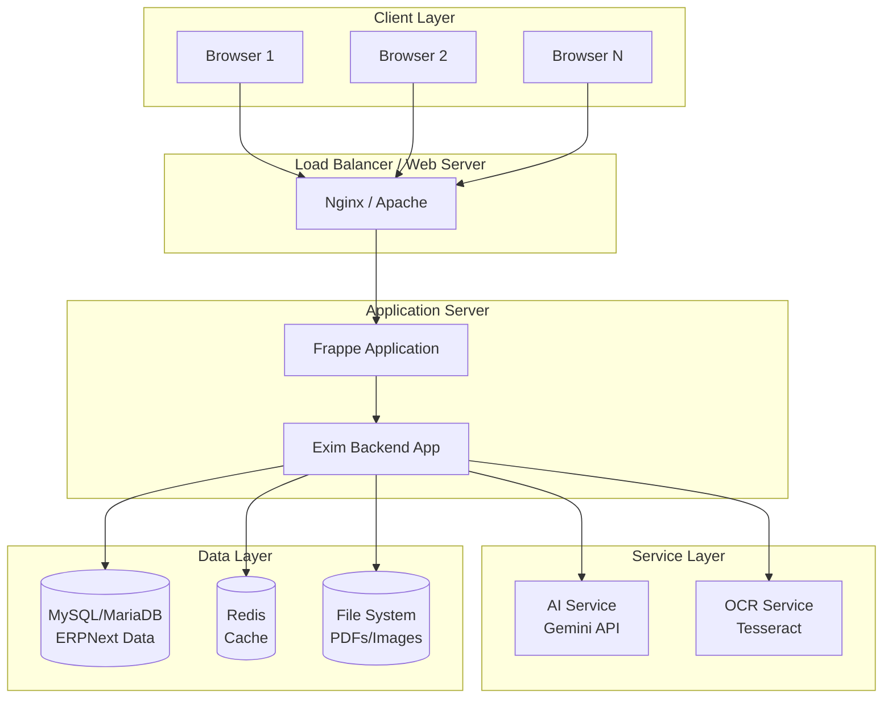

# Exim Backend - System Design Diagrams (Mermaid)

This document contains high-level design diagrams in Mermaid format for the Exim Backend application.

---

## 1. System Architecture Overview

---

## 2. Request Flow Diagram

---

## 3. Component Interaction Diagram

---

## 4. PDF Processing Workflow

---

## 5. AI Processing Flow

---

## 6. DocType Handler Architecture

---

## 7. Session Management Flow

---

## 8. Action Execution Flow

---

## 9. Data Flow - Complete System

---

## 10. System Deployment Architecture

---

## How to Use These Diagrams

### Viewing Mermaid Diagrams

1. **VS Code**: Install "Markdown Preview Mermaid Support" extension
2. **GitHub**: Mermaid diagrams render automatically in markdown files
3. **Online**: Use [Mermaid Live Editor](https://mermaid.live/)
4. **Documentation Tools**: Most modern documentation tools support Mermaid

### Diagram Types Included

1. **System Architecture Overview**: High-level component relationships
2. **Request Flow Diagram**: Sequence of operations
3. **Component Interaction**: Component relationships
4. **PDF Processing Workflow**: PDF handling flow
5. **AI Processing Flow**: AI integration flow
6. **DocType Handler Architecture**: Class diagram of handlers
7. **Session Management Flow**: State diagram for sessions
8. **Action Execution Flow**: Action processing flow
9. **Data Flow**: Complete data flow through system
10. **Deployment Architecture**: Infrastructure diagram

### Customization

You can customize these diagrams by:
- Modifying the Mermaid syntax
- Adding/removing components
- Changing relationships
- Adding more detail to specific flows
- Creating new diagrams for specific use cases

---

## Notes

- All diagrams use standard Mermaid syntax
- Diagrams are designed to be self-contained and readable
- Color coding and styling can be added using Mermaid themes
- Diagrams can be exported as PNG/SVG using Mermaid tools
- These diagrams complement the detailed documentation in `COMPLETE_SYSTEM_DOCUMENTATION.md`

